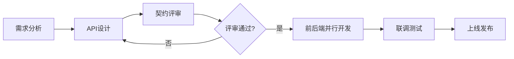
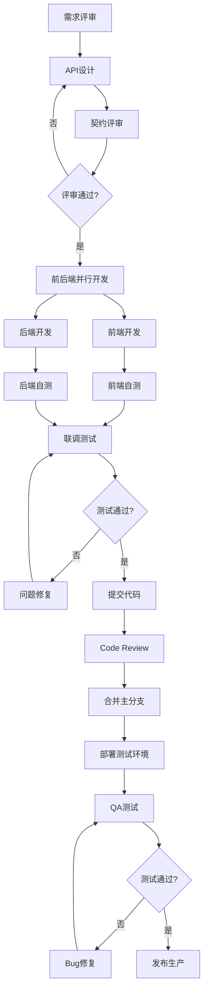

# 前后端协作规范

## 一、API契约先行

### 1.1 契约先行原则

**核心理念**:
- 接口设计先于实现
- 前后端基于契约并行开发
- 契约即文档，文档即契约
- 变更需要双方确认

**工作流程**:


### 1.2 OpenAPI/Swagger规范

**API文档定义** (`openapi.yaml`):
```yaml
openapi: 3.0.0
info:
  title: 多模态文档智能问答系统 API
  version: 1.0.0
  description: 提供文档处理、向量检索和智能问答功能

servers:
  - url: http://localhost:8000
    description: 开发环境
  - url: https://api.example.com
    description: 生产环境

paths:
  /api/v1/query:
    post:
      summary: 文档问答
      description: 基于上传的文档进行智能问答
      tags:
        - Query
      requestBody:
        required: true
        content:
          application/json:
            schema:
              $ref: '#/components/schemas/QueryRequest'
            example:
              question: "这份文档的主要内容是什么？"
              top_k: 5
              enable_thinking: true
      responses:
        '200':
          description: 查询成功
          content:
            application/json:
              schema:
                $ref: '#/components/schemas/QueryResponse'
        '400':
          description: 请求参数错误
          content:
            application/json:
              schema:
                $ref: '#/components/schemas/ErrorResponse'
        '500':
          description: 服务器错误
          content:
            application/json:
              schema:
                $ref: '#/components/schemas/ErrorResponse'

  /api/v1/documents/upload:
    post:
      summary: 上传文档
      description: 上传PDF或DOCX文档进行处理
      tags:
        - Documents
      requestBody:
        required: true
        content:
          multipart/form-data:
            schema:
              type: object
              properties:
                file:
                  type: string
                  format: binary
      responses:
        '201':
          description: 上传成功
          content:
            application/json:
              schema:
                type: object
                properties:
                  document_id:
                    type: string
                    format: uuid
                  status:
                    type: string
                    enum: [processing, completed, failed]

components:
  schemas:
    QueryRequest:
      type: object
      required:
        - question
      properties:
        question:
          type: string
          minLength: 1
          maxLength: 500
          description: 用户问题
        top_k:
          type: integer
          minimum: 1
          maximum: 20
          default: 5
          description: 返回结果数量
        enable_thinking:
          type: boolean
          default: true
          description: 是否启用推理链

    QueryResponse:
      type: object
      required:
        - answer
        - sources
        - processing_time
      properties:
        answer:
          type: string
          description: 回答内容
        thinking:
          type: array
          items:
            $ref: '#/components/schemas/ThinkingStep'
          description: 推理链
        sources:
          type: array
          items:
            $ref: '#/components/schemas/Source'
          description: 参考来源
        processing_time:
          type: number
          format: float
          description: 处理时间（秒）

    ThinkingStep:
      type: object
      required:
        - step
        - content
      properties:
        step:
          type: string
          description: 推理步骤名称
        content:
          type: string
          description: 推理内容

    Source:
      type: object
      properties:
        file_name:
          type: string
        page:
          type: integer
        chunk_id:
          type: string

    ErrorResponse:
      type: object
      required:
        - code
        - message
      properties:
        code:
          type: integer
          description: 错误码
        message:
          type: string
          description: 错误信息
        errors:
          type: array
          items:
            type: object
            properties:
              field:
                type: string
              message:
                type: string
```

### 1.3 契约评审流程

**评审清单**:
- [ ] URL命名是否符合RESTful规范
- [ ] 请求方法是否正确（GET/POST/PUT/DELETE）
- [ ] 请求参数是否完整且有验证规则
- [ ] 响应结构是否清晰
- [ ] 错误码是否定义完整
- [ ] 是否有示例数据
- [ ] 是否考虑了分页、排序、过滤
- [ ] 是否考虑了性能和安全

**评审会议**:
- 参与人员：前端负责人、后端负责人、产品经理
- 会议时长：30-60分钟
- 输出物：评审通过的API文档、待办事项列表

### 1.4 契约变更管理

**变更流程**:
1. 提出变更需求（Issue/文档）
2. 评估影响范围（前端/后端/移动端）
3. 讨论变更方案
4. 更新API文档
5. 通知相关方
6. 实施变更
7. 验证变更

**版本管理**:
- 不兼容变更：升级主版本号 `/api/v2/`
- 兼容性变更：保持版本号，添加新字段
- 废弃接口：标记为deprecated，保留至少一个版本周期

## 二、数据格式统一

### 2.1 命名规则

**字段命名规范**:
- 使用小驼峰命名：`firstName`, `createdAt`
- 布尔值使用is/has前缀：`isActive`, `hasPermission`
- 数组使用复数：`documents`, `users`
- 时间字段统一后缀：`createdAt`, `updatedAt`


### 2.2 数据类型定义

**类型定义原则**:

1. **强类型约束**
   - 前后端必须使用强类型语言特性（TypeScript/Python类型注解）
   - 所有API接口的请求和响应都必须有明确的类型定义
   - 避免使用`any`、`object`等宽泛类型

2. **类型文件共享**
   - 将核心数据类型定义抽取为独立文件
   - 前端TypeScript类型定义与后端Pydantic模型保持一致
   - 建议使用工具自动生成类型定义（如openapi-typescript）

3. **类型命名规范**
   - 请求类型：`{功能}Request`，如`QueryRequest`、`DocumentUploadRequest`
   - 响应类型：`{功能}Response`，如`QueryResponse`、`DocumentListResponse`
   - 实体类型：直接使用名词，如`Document`、`User`、`ThinkingStep`
   - 枚举类型：使用名词，如`DocumentStatus`、`UserRole`

4. **必填与可选字段**
   - 明确标注哪些字段是必填（required）、哪些是可选（optional）
   - 前端使用`?`标记可选字段：`name?: string`
   - 后端使用`Optional`标记：`name: Optional[str] = None`
   - 可选字段应提供合理的默认值

5. **嵌套类型处理**
   - 复杂对象应拆分为独立的类型定义
   - 避免深层嵌套（建议不超过3层）
   - 使用引用而非内联定义：`sources: Source[]`而非`sources: {fileName: string, page: number}[]`

6. **数组与集合**
   - 数组类型明确元素类型：`items: Document[]`
   - 空数组应有默认值：`items: Document[] = []`
   - 大数据集合考虑分页：使用`PaginationResponse<T>`包装

7. **日期时间类型**
   - 统一使用字符串类型传输：`createdAt: string`
   - 注释中说明格式：`/** ISO 8601格式，如2025-02-13T10:30:00Z */`
   - 前端接收后转换为Date对象处理

8. **数值类型精度**
   - 整数：明确范围限制，如`age: number // 0-150`
   - 浮点数：说明精度要求，如`price: number // 保留2位小数`
   - 大数值：考虑使用字符串传输避免精度丢失

9. **联合类型使用**
   - 适度使用联合类型：`status: 'pending' | 'completed' | 'failed'`
   - 优先使用枚举而非字符串字面量联合
   - 避免过于复杂的联合类型

10. **类型版本管理**
    - 类型定义变更需要版本控制
    - 不兼容变更应升级API版本
    - 保留旧版本类型定义至少一个迭代周期

**类型定义文档化**:
- 每个类型都应有清晰的注释说明用途
- 复杂字段添加示例值
- 关键业务规则在注释中体现
- 使用JSDoc/Docstring格式便于IDE提示

**类型验证机制**:
- 后端使用Pydantic自动验证请求数据
- 前端在开发环境启用严格类型检查
- 编写类型测试用例确保类型定义正确
- CI/CD流程中加入类型检查步骤

### 2.3 枚举值统一

**枚举设计原则**:

1. **命名规范**
   - 枚举名使用大驼峰：`DocumentStatus`、`UserRole`
   - 枚举值使用大写下划线或小写：`PROCESSING`或`processing`
   - 保持前后端枚举名称完全一致

2. **值的选择**
   - 优先使用语义化的字符串值：`'processing'`而非`1`
   - 避免使用数字枚举（除非有特殊性能要求）
   - 字符串值应简洁、易读、不易拼错

3. **枚举完整性**
   - 枚举值应覆盖所有可能的状态
   - 避免使用"其他"、"未知"等模糊值
   - 新增枚举值时评估对现有代码的影响

4. **默认值处理**
   - 明确哪个枚举值是默认值
   - 后端数据库字段设置合理的默认值
   - 前端表单提供默认选项

5. **枚举扩展性**
   - 预留扩展空间，避免频繁修改
   - 考虑使用位标志（flag）处理多状态组合
   - 废弃的枚举值标记为deprecated而非直接删除

6. **枚举文档化**
   - 每个枚举值添加注释说明含义
   - 说明枚举值的业务场景和触发条件
   - 记录枚举值之间的状态转换规则

7. **枚举验证**
   - 后端严格验证枚举值的合法性
   - 前端使用下拉框等组件限制用户输入
   - 非法枚举值返回明确的错误提示

8. **枚举国际化**
   - 枚举值本身使用英文
   - 显示文本支持多语言
   - 前端维护枚举值到显示文本的映射表

**常见枚举类型**:

- **状态枚举**：表示资源的生命周期状态
  - 文档状态：`processing`（处理中）、`completed`（已完成）、`failed`（失败）
  - 任务状态：`pending`（待处理）、`running`（运行中）、`success`（成功）、`error`（错误）
  
- **角色枚举**：表示用户权限级别
  - 用户角色：`admin`（管理员）、`user`（普通用户）、`guest`（访客）
  
- **类型枚举**：表示资源的分类
  - 文件类型：`pdf`、`docx`、`txt`
  - 消息类型：`text`、`image`、`file`
  
- **操作枚举**：表示用户行为
  - 操作类型：`create`（创建）、`update`（更新）、`delete`（删除）、`view`（查看）
  
- **排序枚举**：表示排序方式
  - 排序方向：`asc`（升序）、`desc`（降序）
  - 排序字段：`createdAt`、`updatedAt`、`name`

**枚举使用最佳实践**:

1. **前端展示映射**
   - 创建枚举值到中文显示的映射对象
   - 使用工具函数统一处理枚举显示
   - 支持图标、颜色等视觉元素映射

2. **后端存储优化**
   - 数据库使用枚举类型或检查约束
   - 索引常用的枚举字段提升查询性能
   - 考虑使用整数存储、字符串展示的方案

3. **API文档标注**
   - OpenAPI规范中明确列出所有枚举值
   - 提供枚举值的详细说明和示例
   - 标注哪些枚举值已废弃

4. **版本兼容处理**
   - 新增枚举值保持向后兼容
   - 客户端遇到未知枚举值应优雅降级
   - 服务端拒绝不支持的枚举值

5. **测试覆盖**
   - 为每个枚举值编写测试用例
   - 测试枚举值的边界情况
   - 验证枚举值的状态转换逻辑


### 2.4 时间格式统一

**时间格式规范**:
- 统一使用ISO 8601格式：`2025-02-13T10:30:00Z`
- 时区统一使用UTC
- 前端显示时转换为本地时区


## 三、错误处理对齐

### 3.1 错误码体系

**错误码设计**:
```
格式：XXYZZZ
- XX: 模块代码（10=通用, 20=文档, 30=查询, 40=用户）
- Y: 错误类型（0=成功, 1=客户端错误, 2=服务端错误）
- ZZZ: 具体错误序号
```

**错误码定义**:
```typescript
// constants/errorCodes.ts

export const ErrorCodes = {
  // 通用错误 (10xxxx)
  SUCCESS: 100000,
  BAD_REQUEST: 101001,
  UNAUTHORIZED: 101002,
  FORBIDDEN: 101003,
  NOT_FOUND: 101004,
  INTERNAL_ERROR: 102001,
  SERVICE_UNAVAILABLE: 102002,
  
  // 文档错误 (20xxxx)
  DOCUMENT_NOT_FOUND: 201001,
  DOCUMENT_UPLOAD_FAILED: 201002,
  DOCUMENT_PROCESSING_FAILED: 201003,
  INVALID_FILE_TYPE: 201004,
  FILE_TOO_LARGE: 201005,
  
  // 查询错误 (30xxxx)
  QUERY_FAILED: 301001,
  INVALID_QUERY: 301002,
  NO_RESULTS: 301003,
  RETRIEVAL_FAILED: 301004,
  
  // 用户错误 (40xxxx)
  USER_NOT_FOUND: 401001,
  INVALID_CREDENTIALS: 401002,
  TOKEN_EXPIRED: 401003,
} as const;

export const ErrorMessages: Record<number, string> = {
  [ErrorCodes.SUCCESS]: '操作成功',
  [ErrorCodes.BAD_REQUEST]: '请求参数错误',
  [ErrorCodes.UNAUTHORIZED]: '未授权，请先登录',
  [ErrorCodes.FORBIDDEN]: '无权限执行此操作',
  [ErrorCodes.NOT_FOUND]: '请求的资源不存在',
  [ErrorCodes.INTERNAL_ERROR]: '服务器内部错误',
  [ErrorCodes.SERVICE_UNAVAILABLE]: '服务暂时不可用',
  
  [ErrorCodes.DOCUMENT_NOT_FOUND]: '文档不存在',
  [ErrorCodes.DOCUMENT_UPLOAD_FAILED]: '文档上传失败',
  [ErrorCodes.DOCUMENT_PROCESSING_FAILED]: '文档处理失败',
  [ErrorCodes.INVALID_FILE_TYPE]: '不支持的文件类型',
  [ErrorCodes.FILE_TOO_LARGE]: '文件大小超过限制',
  
  [ErrorCodes.QUERY_FAILED]: '查询失败',
  [ErrorCodes.INVALID_QUERY]: '无效的查询',
  [ErrorCodes.NO_RESULTS]: '未找到相关结果',
  [ErrorCodes.RETRIEVAL_FAILED]: '检索失败',
  
  [ErrorCodes.USER_NOT_FOUND]: '用户不存在',
  [ErrorCodes.INVALID_CREDENTIALS]: '用户名或密码错误',
  [ErrorCodes.TOKEN_EXPIRED]: '登录已过期，请重新登录',
};
```

### 3.2 HTTP状态码映射

**状态码使用规范**:
```typescript
// constants/httpStatus.ts

export const HttpStatus = {
  OK: 200,                    // 成功
  CREATED: 201,               // 创建成功
  NO_CONTENT: 204,            // 删除成功
  BAD_REQUEST: 400,           // 请求参数错误
  UNAUTHORIZED: 401,          // 未认证
  FORBIDDEN: 403,             // 无权限
  NOT_FOUND: 404,             // 资源不存在
  CONFLICT: 409,              // 资源冲突
  UNPROCESSABLE_ENTITY: 422,  // 验证失败
  TOO_MANY_REQUESTS: 429,     // 请求过多
  INTERNAL_SERVER_ERROR: 500, // 服务器错误
  SERVICE_UNAVAILABLE: 503,   // 服务不可用
} as const;

/**
 * 业务错误码到HTTP状态码的映射
 */
export const errorCodeToHttpStatus = (errorCode: number): number => {
  const category = Math.floor(errorCode / 1000) % 10;
  
  switch (category) {
    case 1: // 客户端错误
      if (errorCode === ErrorCodes.UNAUTHORIZED) return HttpStatus.UNAUTHORIZED;
      if (errorCode === ErrorCodes.FORBIDDEN) return HttpStatus.FORBIDDEN;
      if (errorCode === ErrorCodes.NOT_FOUND) return HttpStatus.NOT_FOUND;
      return HttpStatus.BAD_REQUEST;
    case 2: // 服务端错误
      if (errorCode === ErrorCodes.SERVICE_UNAVAILABLE) return HttpStatus.SERVICE_UNAVAILABLE;
      return HttpStatus.INTERNAL_SERVER_ERROR;
    default:
      return HttpStatus.OK;
  }
};
```

### 3.3 错误响应格式

**统一错误响应**:
```typescript
// types/error.ts

export interface ErrorDetail {
  field: string;
  message: string;
}

export interface ErrorResponse {
  code: number;
  message: string;
  errors?: ErrorDetail[];
  timestamp: string;
  path?: string;
  requestId?: string;
}

// 示例
const errorResponse: ErrorResponse = {
  code: 201004,
  message: '不支持的文件类型',
  errors: [
    {
      field: 'file',
      message: '仅支持PDF和DOCX格式',
    },
  ],
  timestamp: '2025-02-13T10:30:00Z',
  path: '/api/v1/documents/upload',
  requestId: 'req-123456',
};
```

### 3.4 前端错误展示

**错误处理工具**:
```typescript
// utils/errorHandler.ts

import { ErrorCodes, ErrorMessages } from '@/constants/errorCodes';
import { ErrorResponse } from '@/types/error';

/**
 * 获取用户友好的错误信息
 */
export const getUserFriendlyMessage = (error: ErrorResponse): string => {
  // 优先使用服务端返回的消息
  if (error.message) {
    return error.message;
  }
  
  // 使用预定义的错误消息
  if (error.code in ErrorMessages) {
    return ErrorMessages[error.code];
  }
  
  // 默认消息
  return '操作失败，请稍后重试';
};

/**
 * 显示错误提示
 */
export const showError = (error: ErrorResponse | Error | string) => {
  let message: string;
  
  if (typeof error === 'string') {
    message = error;
  } else if (error instanceof Error) {
    message = error.message;
  } else {
    message = getUserFriendlyMessage(error);
  }
  
  // 使用Toast组件显示
  toast.error(message);
  
  // 记录错误日志
  console.error('Error:', error);
};
```

# 前后端协作规范（续）

## 四、联调环境规范

### 4.1 开发环境搭建

**Docker Compose统一环境**:
```yaml
# docker-compose.dev.yml
version: '3.8'

services:
  # 后端服务
  backend:
    build:
      context: ./backend
      dockerfile: Dockerfile.dev
    ports:
      - "8000:8000"
    environment:
      - POSTGRES_HOST=postgres
      - REDIS_HOST=redis
      - MILVUS_HOST=milvus
      - OLLAMA_BASE_URL=http://ollama:11434
    volumes:
      - ./backend:/app
      - backend_data:/app/data
    depends_on:
      - postgres
      - redis
      - milvus
      - ollama
    command: uvicorn app.main:app --host 0.0.0.0 --port 8000 --reload

  # 前端服务
  frontend:
    build:
      context: ./frontend
      dockerfile: Dockerfile.dev
    ports:
      - "3000:3000"
    environment:
      - REACT_APP_API_BASE_URL=http://localhost:8000
    volumes:
      - ./frontend:/app
      - /app/node_modules
    command: npm start

  # PostgreSQL数据库
  postgres:
    image: postgres:15-alpine
    environment:
      POSTGRES_DB: docqa
      POSTGRES_USER: admin
      POSTGRES_PASSWORD: dev_password
    ports:
      - "5432:5432"
    volumes:
      - postgres_data:/var/lib/postgresql/data
      - ./scripts/init.sql:/docker-entrypoint-initdb.d/init.sql

  # Redis缓存
  redis:
    image: redis:7-alpine
    ports:
      - "6379:6379"
    volumes:
      - redis_data:/data

  # Milvus向量数据库
  milvus:
    image: milvusdb/milvus:v2.4.0
    ports:
      - "19530:19530"
      - "9091:9091"
    environment:
      ETCD_ENDPOINTS: etcd:2379
      MINIO_ADDRESS: minio:9000
    volumes:
      - milvus_data:/var/lib/milvus
    depends_on:
      - etcd
      - minio

  # Ollama模型服务
  ollama:
    image: ollama/ollama:latest
    ports:
      - "11434:11434"
    volumes:
      - ollama_data:/root/.ollama
    environment:
      - OLLAMA_HOST=0.0.0.0

  # Etcd (Milvus依赖)
  etcd:
    image: quay.io/coreos/etcd:v3.5.5
    environment:
      - ETCD_AUTO_COMPACTION_MODE=revision
      - ETCD_AUTO_COMPACTION_RETENTION=1000
    volumes:
      - etcd_data:/etcd

  # MinIO (Milvus依赖)
  minio:
    image: minio/minio:latest
    environment:
      MINIO_ROOT_USER: minioadmin
      MINIO_ROOT_PASSWORD: minioadmin
    volumes:
      - minio_data:/minio_data
    command: minio server /minio_data

volumes:
  backend_data:
  postgres_data:
  redis_data:
  milvus_data:
  ollama_data:
  etcd_data:
  minio_data:
```

**启动命令**:
```bash
# 启动所有服务
docker-compose -f docker-compose.dev.yml up -d

# 查看日志
docker-compose -f docker-compose.dev.yml logs -f backend

# 停止服务
docker-compose -f docker-compose.dev.yml down

# 重启单个服务
docker-compose -f docker-compose.dev.yml restart backend
```

### 4.2 数据Mock规则

**Mock数据生成**:
```typescript
// frontend/src/mocks/data.ts

import { Document, QueryResponse } from '@/types';

/**
 * 生成Mock文档列表
 */
export const mockDocuments: Document[] = [
  {
    id: '550e8400-e29b-41d4-a716-446655440001',
    fileName: '产品需求文档.pdf',
    fileType: 'application/pdf',
    fileSize: 2048576,
    status: 'completed',
    createdAt: '2025-02-13T10:00:00Z',
    updatedAt: '2025-02-13T10:05:00Z',
  },
  {
    id: '550e8400-e29b-41d4-a716-446655440002',
    fileName: '技术方案.docx',
    fileType: 'application/vnd.openxmlformats-officedocument.wordprocessingml.document',
    fileSize: 1024000,
    status: 'processing',
    createdAt: '2025-02-13T11:00:00Z',
    updatedAt: '2025-02-13T11:00:00Z',
  },
];

/**
 * 生成Mock查询响应
 */
export const mockQueryResponse: QueryResponse = {
  answer: `根据文档内容，该系统是一个多模态文档智能问答系统，主要功能包括：

1. **文档处理**：支持PDF、DOCX等格式的文档上传和解析
2. **向量检索**：使用ChromaDB和Milvus进行文本和图像的向量存储
3. **智能问答**：基于Qwen3-VL模型进行多模态理解和回答
4. **推理可视化**：展示AI的思考过程

系统采用FastAPI后端和React前端，支持本地化部署。`,
  thinking: [
    {
      step: '问题分析',
      content: '用户询问系统的主要功能，需要从文档中提取核心功能点',
    },
    {
      step: '信息检索',
      content: '从文档的功能介绍章节检索到4个主要功能模块',
    },
    {
      step: '答案组织',
      content: '按照功能分类，使用列表形式组织答案，便于阅读',
    },
  ],
  sources: [
    {
      fileName: '产品需求文档.pdf',
      page: 3,
      chunkId: 'chunk-001',
    },
    {
      fileName: '技术方案.docx',
      page: 1,
      chunkId: 'chunk-015',
    },
  ],
  processingTime: 2.35,
};

/**
 * Mock数据生成器
 */
export const mockDataGenerator = {
  /**
   * 生成随机文档
   */
  generateDocument: (): Document => ({
    id: crypto.randomUUID(),
    fileName: `文档_${Date.now()}.pdf`,
    fileType: 'application/pdf',
    fileSize: Math.floor(Math.random() * 5000000),
    status: ['processing', 'completed', 'failed'][Math.floor(Math.random() * 3)] as any,
    createdAt: new Date().toISOString(),
    updatedAt: new Date().toISOString(),
  }),

  /**
   * 生成延迟
   */
  delay: (ms: number = 1000) => new Promise((resolve) => setTimeout(resolve, ms)),
};
```

**MSW (Mock Service Worker) 配置**:
```typescript
// frontend/src/mocks/handlers.ts
import { rest } from 'msw';
import { mockDocuments, mockQueryResponse, mockDataGenerator } from './data';

const API_BASE_URL = 'http://localhost:8000';

export const handlers = [
  // 查询接口
  rest.post(`${API_BASE_URL}/api/v1/query`, async (req, res, ctx) => {
    await mockDataGenerator.delay(2000); // 模拟网络延迟
    return res(ctx.status(200), ctx.json(mockQueryResponse));
  }),

  // 文档列表
  rest.get(`${API_BASE_URL}/api/v1/documents`, async (req, res, ctx) => {
    await mockDataGenerator.delay(500);
    return res(ctx.status(200), ctx.json(mockDocuments));
  }),

  // 文档上传
  rest.post(`${API_BASE_URL}/api/v1/documents/upload`, async (req, res, ctx) => {
    await mockDataGenerator.delay(3000);
    return res(
      ctx.status(201),
      ctx.json({
        documentId: crypto.randomUUID(),
        status: 'processing',
      })
    );
  }),

  // 文档删除
  rest.delete(`${API_BASE_URL}/api/v1/documents/:id`, async (req, res, ctx) => {
    await mockDataGenerator.delay(500);
    return res(ctx.status(204));
  }),
];

// frontend/src/mocks/browser.ts
import { setupWorker } from 'msw';
import { handlers } from './handlers';

export const worker = setupWorker(...handlers);

// frontend/src/index.tsx
if (process.env.REACT_APP_USE_MOCK === 'true') {
  const { worker } = require('./mocks/browser');
  worker.start();
}
```

### 4.3 跨域解决方案

**开发环境代理配置**:

**方案1：前端代理** (`package.json`):
```json
{
  "proxy": "http://localhost:8000"
}
```

**方案2：setupProxy.js**:
```javascript
// frontend/src/setupProxy.js
const { createProxyMiddleware } = require('http-proxy-middleware');

module.exports = function(app) {
  app.use(
    '/api',
    createProxyMiddleware({
      target: 'http://localhost:8000',
      changeOrigin: true,
      pathRewrite: {
        '^/api': '/api',
      },
      onProxyReq: (proxyReq, req, res) => {
        console.log('Proxying:', req.method, req.path);
      },
    })
  );
};
```

**方案3：后端CORS配置**:
```python
# backend/app/main.py
from fastapi import FastAPI
from fastapi.middleware.cors import CORSMiddleware

app = FastAPI()

# 开发环境允许所有来源
if settings.app_env == "development":
    app.add_middleware(
        CORSMiddleware,
        allow_origins=["*"],
        allow_credentials=True,
        allow_methods=["*"],
        allow_headers=["*"],
    )
else:
    # 生产环境指定来源
    app.add_middleware(
        CORSMiddleware,
        allow_origins=settings.allowed_origins,
        allow_credentials=True,
        allow_methods=["GET", "POST", "PUT", "DELETE"],
        allow_headers=["*"],
    )
```

### 4.4 接口调试工具

**Postman Collection**:
```json
{
  "info": {
    "name": "多模态文档智能问答系统 API",
    "schema": "https://schema.getpostman.com/json/collection/v2.1.0/collection.json"
  },
  "item": [
    {
      "name": "Query",
      "item": [
        {
          "name": "文档问答",
          "request": {
            "method": "POST",
            "header": [
              {
                "key": "Content-Type",
                "value": "application/json"
              }
            ],
            "body": {
              "mode": "raw",
              "raw": "{\n  \"question\": \"这份文档的主要内容是什么？\",\n  \"topK\": 5,\n  \"enableThinking\": true\n}"
            },
            "url": {
              "raw": "{{baseUrl}}/api/v1/query",
              "host": ["{{baseUrl}}"],
              "path": ["api", "v1", "query"]
            }
          }
        }
      ]
    },
    {
      "name": "Documents",
      "item": [
        {
          "name": "上传文档",
          "request": {
            "method": "POST",
            "header": [],
            "body": {
              "mode": "formdata",
              "formdata": [
                {
                  "key": "file",
                  "type": "file",
                  "src": "/path/to/document.pdf"
                }
              ]
            },
            "url": {
              "raw": "{{baseUrl}}/api/v1/documents/upload",
              "host": ["{{baseUrl}}"],
              "path": ["api", "v1", "documents", "upload"]
            }
          }
        },
        {
          "name": "获取文档列表",
          "request": {
            "method": "GET",
            "url": {
              "raw": "{{baseUrl}}/api/v1/documents?page=1&pageSize=10",
              "host": ["{{baseUrl}}"],
              "path": ["api", "v1", "documents"],
              "query": [
                {"key": "page", "value": "1"},
                {"key": "pageSize", "value": "10"}
              ]
            }
          }
        }
      ]
    }
  ],
  "variable": [
    {
      "key": "baseUrl",
      "value": "http://localhost:8000",
      "type": "string"
    }
  ]
}
```

**cURL命令示例**:
```bash
# 文档问答
curl -X POST http://localhost:8000/api/v1/query \
  -H "Content-Type: application/json" \
  -d '{
    "question": "这份文档的主要内容是什么？",
    "topK": 5,
    "enableThinking": true
  }'

# 上传文档
curl -X POST http://localhost:8000/api/v1/documents/upload \
  -F "file=@/path/to/document.pdf"

# 获取文档列表
curl -X GET "http://localhost:8000/api/v1/documents?page=1&pageSize=10"
```

## 五、协作流程与最佳实践

### 5.1 开发流程



### 5.2 沟通机制

**日常沟通**:
- 每日站会：同步进度和问题
- 技术讨论：复杂问题集中讨论
- 文档记录：重要决策记录在文档

**问题反馈**:
- 使用Issue跟踪问题
- 标签分类：bug、feature、question
- 优先级标记：P0-P3

**变更通知**:
- API变更：提前通知，给出迁移时间
- 数据结构变更：更新类型定义文件
- 重大变更：召开技术评审会

### 5.3 联调测试清单

**接口测试**:
- [ ] 正常场景测试
- [ ] 边界值测试
- [ ] 异常场景测试
- [ ] 并发测试
- [ ] 性能测试

**数据验证**:
- [ ] 请求参数验证
- [ ] 响应数据格式验证
- [ ] 错误信息验证
- [ ] 时间格式验证
- [ ] 枚举值验证

**用户体验**:
- [ ] 加载状态显示
- [ ] 错误提示友好
- [ ] 操作反馈及时
- [ ] 边界情况处理
- [ ] 性能优化

### 5.4 文档维护

**必备文档**:
1. **API文档**：OpenAPI规范，自动生成
2. **类型定义**：TypeScript/Python类型文件
3. **错误码文档**：错误码和消息对照表
4. **变更日志**：API变更记录
5. **联调指南**：环境搭建和调试方法

**文档更新流程**:
1. 代码变更时同步更新文档
2. 每周检查文档准确性
3. 版本发布时更新变更日志
4. 定期清理过期文档

## 六、常见问题与解决方案

### 6.1 接口联调问题

**问题1：跨域错误**
```
Access to XMLHttpRequest at 'http://localhost:8000/api/v1/query' 
from origin 'http://localhost:3000' has been blocked by CORS policy
```
**解决方案**：
- 后端配置CORS中间件
- 前端使用代理
- 开发环境使用`--disable-web-security`（不推荐）

**问题2：请求超时**
```
Error: timeout of 30000ms exceeded
```
**解决方案**：
- 增加超时时间配置
- 优化后端处理性能
- 使用流式响应

**问题3：数据格式不匹配**
```
TypeError: Cannot read property 'data' of undefined
```
**解决方案**：
- 检查API文档和实际响应
- 使用TypeScript类型检查
- 添加响应数据验证

### 6.2 数据同步问题

**问题：前后端字段名不一致**
```typescript
// 后端返回
{ "created_at": "2025-02-13T10:00:00Z" }

// 前端期望
{ "createdAt": "2025-02-13T10:00:00Z" }
```
**解决方案**：
- 统一使用驼峰命名
- 后端使用别名配置
- 前端添加字段映射

**问题：时间格式不统一**
```typescript
// 后端返回多种格式
"2025-02-13"
"2025-02-13 10:00:00"
"1707818400"
```
**解决方案**：
- 统一使用ISO 8601格式
- 前端统一时间处理函数
- 后端序列化配置

### 6.3 性能优化

**问题：接口响应慢**
**解决方案**：
- 后端添加缓存
- 数据库查询优化
- 使用CDN加速静态资源
- 前端添加请求防抖

**问题：大文件上传失败**
**解决方案**：
- 分片上传
- 断点续传
- 压缩文件
- 增加超时时间

## 七、附录

### 7.1 工具推荐

**API开发**:
- Swagger UI：API文档可视化
- Postman：接口测试
- Insomnia：REST客户端

**Mock工具**:
- MSW：前端Mock
- JSON Server：快速Mock API
- Mockoon：桌面Mock工具

**调试工具**:
- Chrome DevTools：网络调试
- React DevTools：React调试
- Redux DevTools：状态调试

### 7.2 参考资源

- [OpenAPI规范](https://swagger.io/specification/)
- [RESTful API设计指南](https://restfulapi.net/)
- [HTTP状态码](https://httpstatuses.com/)
- [CORS详解](https://developer.mozilla.org/zh-CN/docs/Web/HTTP/CORS)

### 7.3 检查清单

**API设计检查**:
- [ ] URL符合RESTful规范
- [ ] 请求方法正确
- [ ] 参数验证完整
- [ ] 响应结构统一
- [ ] 错误处理完善
- [ ] 文档完整准确

**联调准备检查**:
- [ ] 环境搭建完成
- [ ] 依赖服务启动
- [ ] Mock数据准备
- [ ] 调试工具配置
- [ ] 文档同步更新

**上线前检查**:
- [ ] 所有接口测试通过
- [ ] 错误处理验证
- [ ] 性能测试达标
- [ ] 安全检查通过
- [ ] 文档更新完成
- [ ] 变更日志记录

---

## 版本历史

| 版本 | 日期 | 变更内容 | 负责人 |
|------|------|---------|--------|
| v1.0 | 2026-02-13 | 初始版本 | 技术团队 |

---

**文档维护**: 技术团队  
**最后更新**: 2026-02-13  


