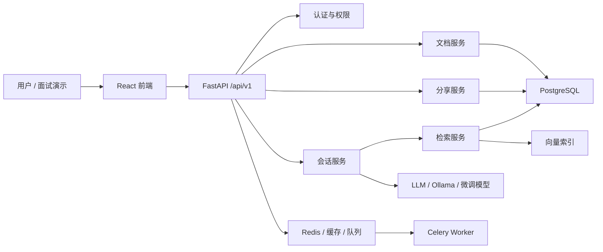
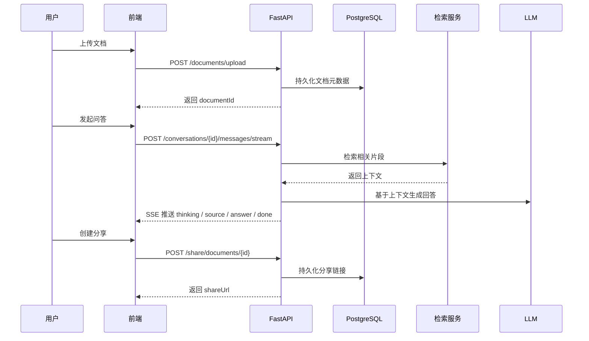

# Multimodal DocQA

## 项目背景

本项目希望解决“企业内知识文档难检索、难引用、难分享”的问题。用户上传 PDF / DOCX / Markdown / 文本后，系统完成解析、切块、向量化与检索，并基于检索结果生成带引用意识的回答。

## 核心能力

- 文档中心：单文件 / 批量上传、详情预览、标签管理、分享链接
- 对话工作台：多轮对话、SSE 流式回答、思考过程与来源展示
- 安全边界：文档接口统一鉴权，管理员接口统一角色校验
- 可观测性：真实 `/health`、`/health/detailed`、`/stats`、请求 ID 日志
- 抗幻觉：Prompt 版本管理、文档约束问答、无证据时明确拒答

## 技术栈

- 后端：FastAPI、SQLAlchemy、PostgreSQL、Redis、Celery、Loguru
- 检索：向量检索 / 混合检索 / reranker 实验框架
- 前端：React、Vite、TypeScript、TanStack Query、Zustand、Playwright
- AI 接口：Ollama / 可替换自定义模型服务

## 架构





## 关键难点

- 数据一致性：文档列表、详情、状态、分享统一改为数据库真相源
- 权限设计：`documents` / `share` 默认鉴权，`admin` 路由统一管理员依赖
- 可恢复性：重启后文档元数据、分享信息和状态可从持久层恢复
- 可解释性：SSE 过程拆分为 `thinking / source / answer / done`
- 幻觉控制：文档约束场景下无检索结果时返回“未找到依据”

## 评测与实验

- 评测集：`backend/scripts/evaluation/rag_eval_dataset.json`
- 示例文档：`backend/scripts/evaluation/sample_docs/`
- 评测脚本：`backend/scripts/run_rag_eval_baseline.py`
- 实验说明：`DevelopDoc/backendDoc/RAG评测与实验说明.md`

默认建议对比三组方案：

1. 纯向量检索
2. 混合检索（向量 + 关键词）
3. 混合检索 + reranker

建议保留四项指标：

- 命中率
- 主观相关性
- 引用正确率
- 平均时延

## 启动方式

### 1. 本地最小演示

后端：

```bash
cd backend
conda activate multimodal-docqa
pip install -r requirements.txt
python -m compileall app
pytest -q tests/unit/test_config.py tests/unit/test_document_processor.py tests/unit/test_ollama_client.py tests/unit/test_document_route_service.py tests/unit/test_permission_service.py tests/unit/test_share_routes.py tests/unit/test_share_service.py
python -m uvicorn app.main:app --reload
```

前端：

```bash
cd frontend
npm install
npm run typecheck
npm run test
npm run build
npm run dev
```

### 2. Docker 启动

```bash
cd backend
docker compose up -d postgres redis ollama
docker compose up -d --build backend celery-worker
```

### 3. 演示路径

1. 登录进入 `/workspace`
2. 打开 `/documents` 上传文档
3. 返回 `/workspace` 发起流式问答
4. 在 `/documents` 创建分享链接
5. 打开 `/share/:token` 验证分享访问

## 验证基线

- 后端：`python -m compileall app`
- 后端 smoke：见上方 `pytest -q ...`
- 前端：`npm run typecheck`
- 前端单测：`npm run test`
- 前端构建：`npm run build`
- 前端 E2E：`npm run test:e2e`

## 当前已完成整改

- 清理明文测试凭据与导出产物，补充根 `.gitignore`
- 文档 / 分享接口切换到数据库真相源
- 管理员路由改为统一角色依赖
- `/health` 与 `/stats` 改为真实检查与真实统计
- Prompt 加入版本号与 grounded answer 约束
- 前端修复刷新后误跳登录问题，补齐 E2E 主流程

## 已知说明

- `Ollama` 当前可暂时不通，README 与演示路径已明确标注
- 评测脚本已落地，但实验结果仍需要你在接入最终模型后跑出正式数据
- 若全量重模型测试成本过高，可先以 smoke + 关键集成 + 评测脚本组合交付
