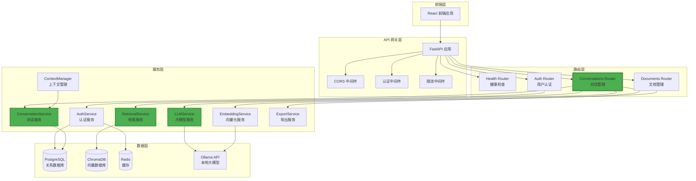
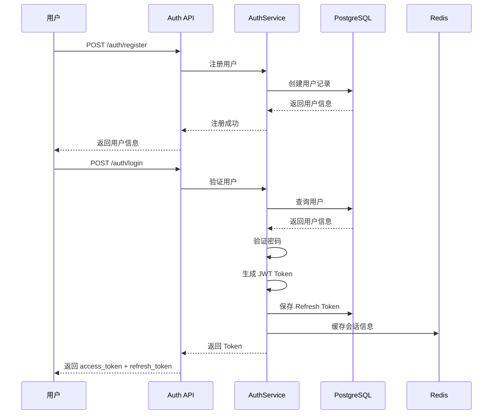
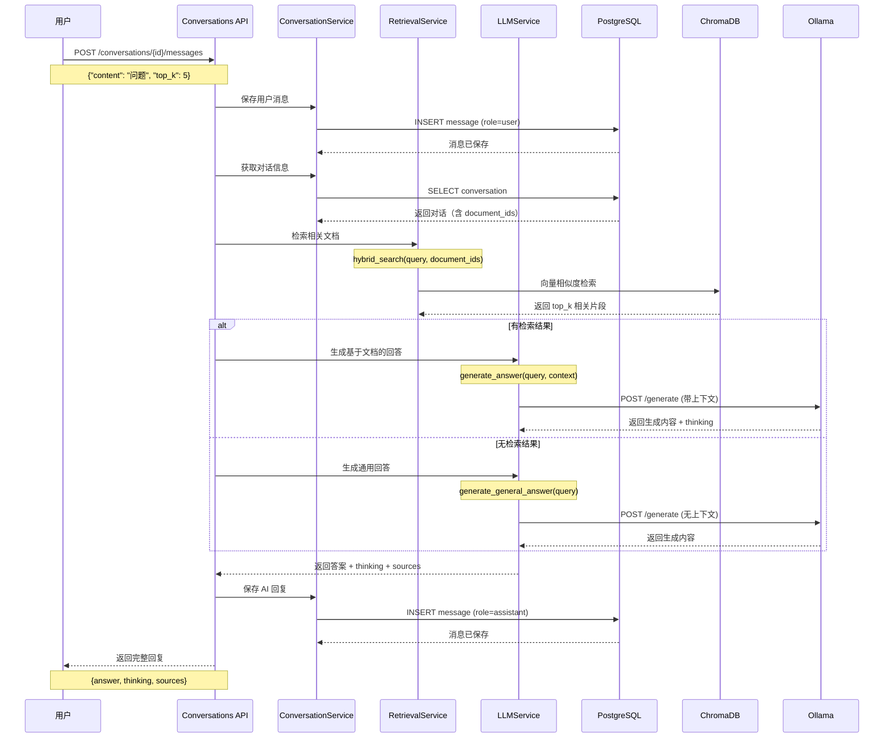
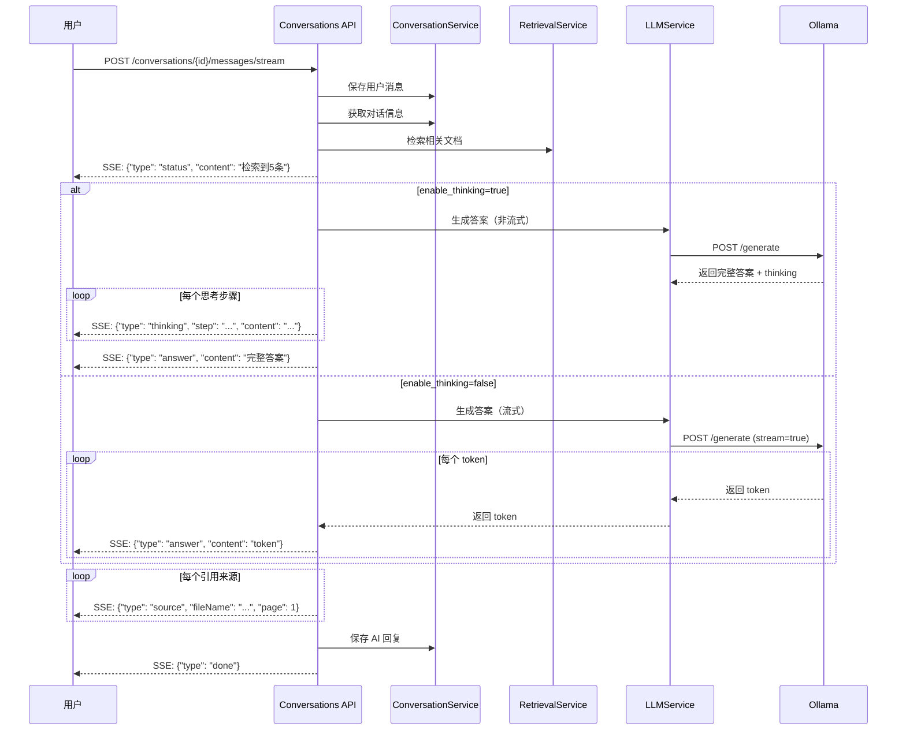
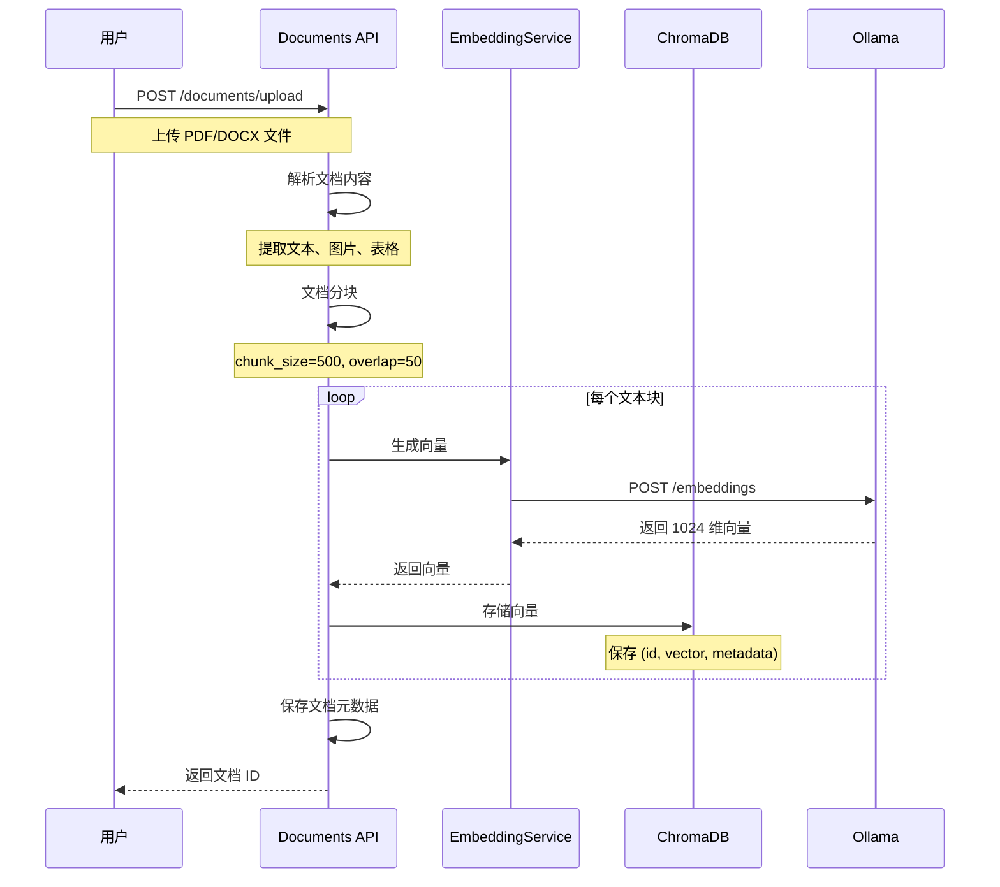
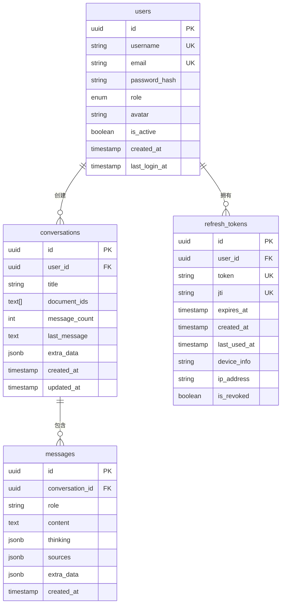
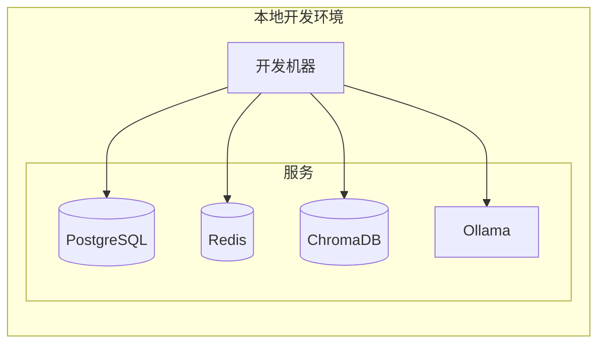
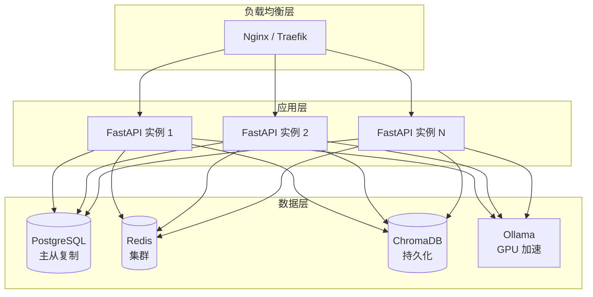

# 多模态文档智能问答系统 - 技术架构文档

## 系统概述

本系统是一个基于 FastAPI + Ollama + ChromaDB 的本地化文档智能问答系统，支持多轮对话、RAG 检索增强生成、用户认证等功能。

## 整体架构



## 核心流程

### 1. 用户认证流程



### 2. 对话消息流程（RAG）



### 3. 流式消息流程



### 4. 文档上传与向量化流程



## 数据模型

### 数据库表结构



### ChromaDB 集合结构

```python
{
    "collection_name": "documents",
    "dimension": 1024,
    "documents": [
        {
            "id": "chunk-uuid",
            "embedding": [0.1, 0.2, ...],  # 1024维向量
            "metadata": {
                "document_id": "doc-uuid",
                "page": 1,
                "chunk_index": 0,
                "content": "文档内容片段..."
            }
        }
    ]
}
```

## 技术栈

### 后端技术

| 技术 | 版本 | 用途 |
|------|------|------|
| Python | 3.11+ | 编程语言 |
| FastAPI | 0.104+ | Web 框架 |
| SQLAlchemy | 2.0+ | ORM |
| Pydantic | 2.0+ | 数据验证 |
| PostgreSQL | 14+ | 关系数据库 |
| ChromaDB | 0.4+ | 向量数据库 |
| Redis | 7+ | 缓存 |
| Ollama | - | 本地大模型 |

### 核心依赖

```txt
fastapi==0.104.1
uvicorn==0.24.0
sqlalchemy==2.0.23
asyncpg==0.29.0
pydantic==2.5.0
pydantic-settings==2.1.0
chromadb==0.4.18
redis==5.0.1
python-jose[cryptography]==3.3.0
passlib[bcrypt]==1.7.4
bcrypt==4.1.2
python-multipart==0.0.6
slowapi==0.1.9
loguru==0.7.2
requests==2.31.0
aiohttp==3.9.1
```

## 部署架构

### 开发环境



### 生产环境（建议）



## 性能优化

### 1. 数据库优化

- 使用连接池（asyncpg）
- 添加索引（user_id, conversation_id, created_at）
- 定期清理过期数据

### 2. 缓存策略

- Redis 缓存用户会话
- Redis 缓存热门查询结果
- Token 黑名单使用 Redis TTL

### 3. 向量检索优化

- ChromaDB 使用 HNSW 索引
- 限制检索数量（top_k <= 20）
- 批量向量化处理

### 4. LLM 调用优化

- 使用流式响应减少等待时间
- 控制上下文长度
- 合理设置 temperature 参数

## 安全措施

### 1. 认证与授权

- JWT Token 认证
- Refresh Token 数据库存储
- Token 黑名单机制
- 会话管理（多设备登录）

### 2. 接口安全

- CORS 配置
- 请求限流（SlowAPI）
- 输入验证（Pydantic）
- SQL 注入防护（SQLAlchemy ORM）

### 3. 数据安全

- 密码哈希（bcrypt）
- 敏感信息加密
- 数据库连接加密
- 定期备份

## 监控与日志

### 1. 日志系统

```python
# 使用 loguru
logger.info("用户登录成功: {username}", username=user.username)
logger.error("查询失败: {error}", error=str(e))
```

### 2. 监控指标

- API 响应时间
- 数据库查询性能
- 向量检索耗时
- LLM 生成耗时
- 错误率统计

### 3. 健康检查

```
GET /api/v1/health
{
  "status": "healthy",
  "database": "connected",
  "redis": "connected",
  "chromadb": "connected",
  "ollama": "connected"
}
```

## 扩展性设计

### 1. 水平扩展

- 无状态 API 设计
- 支持多实例部署
- 负载均衡

### 2. 功能扩展

- 插件化架构
- 支持多种向量数据库
- 支持多种 LLM 后端
- 支持多种文档格式

### 3. 性能扩展

- 异步处理
- 批量操作
- 缓存优化

## 开发规范

### 1. 代码结构

```
backend/
├── app/
│   ├── api/          # API 路由
│   ├── models/       # 数据模型
│   ├── schemas/      # Pydantic 模型
│   ├── services/     # 业务逻辑
│   ├── utils/        # 工具函数
│   └── main.py       # 应用入口
├── scripts/          # 脚本工具
├── tests/            # 测试代码
└── docs/             # 文档
```

### 2. 命名规范

- 文件名：小写下划线（snake_case）
- 类名：大驼峰（PascalCase）
- 函数名：小写下划线（snake_case）
- 常量：大写下划线（UPPER_CASE）

### 3. 注释规范

```python
def function_name(param1: str, param2: int) -> dict:
    """
    函数简短描述
    
    Args:
        param1: 参数1说明
        param2: 参数2说明
        
    Returns:
        返回值说明
        
    Raises:
        异常说明
    """
    pass
```

## 测试策略

### 1. 单元测试

- 测试服务层逻辑
- 测试工具函数
- 覆盖率 > 80%

### 2. 集成测试

- 测试 API 接口
- 测试数据库操作
- 测试外部服务调用

### 3. 性能测试

- 压力测试
- 并发测试
- 响应时间测试

## 版本历史

### Phase 1 (v1.0.0)
- ✅ 基础 RAG 功能
- ✅ 文档上传与处理
- ✅ 单次问答接口
- ✅ 用户认证

### Phase 2 (v2.0.0)
- ✅ 对话管理功能
- ✅ 整合 RAG 到对话
- ✅ 流式响应
- ✅ 对话导出
- ✅ 废弃 query 接口

### 未来计划
- ⏳ WebSocket 实时推送
- ⏳ 对话分享功能
- ⏳ 全文搜索
- ⏳ 多模态支持（图片、语音）
- ⏳ 知识图谱

## 参考资料

- [FastAPI 官方文档](https://fastapi.tiangolo.com/)
- [SQLAlchemy 文档](https://docs.sqlalchemy.org/)
- [ChromaDB 文档](https://docs.trychroma.com/)
- [Ollama 文档](https://ollama.ai/docs)

---

**文档维护**: 后端团队  
**最后更新**: 2026-02-14

