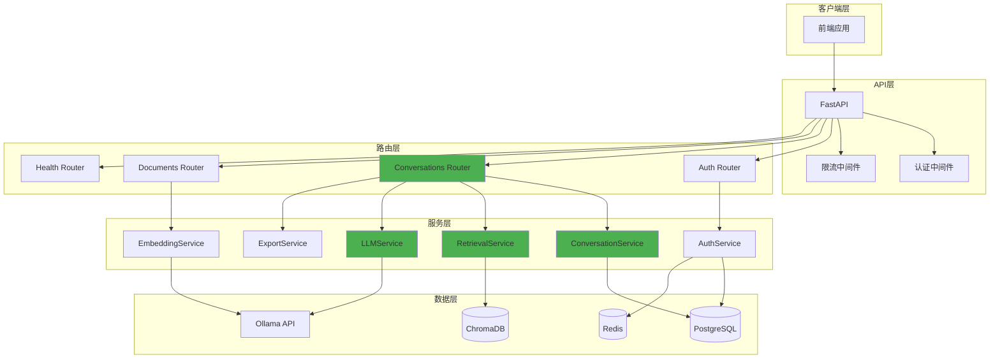
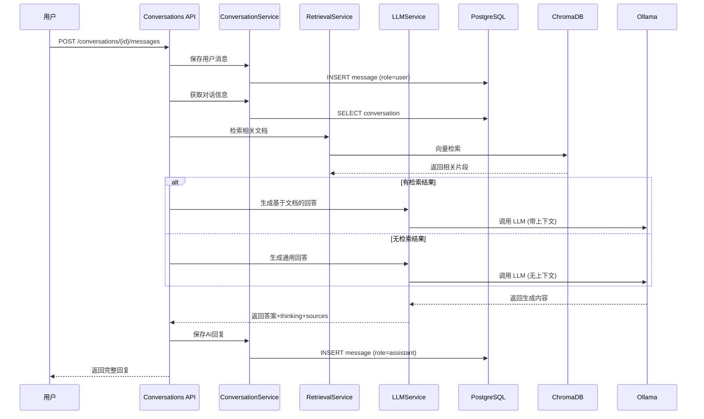

# Phase 2 快速启动指南 - 对话管理功能

## 概述

Phase 2 实现了完整的对话管理功能，整合了 Phase 1 的 RAG 能力，支持多轮对话、智能问答、上下文管理和对话导出。

## 架构变更

### Phase 2 重要更新
- ✅ **整合 RAG 功能**：将 Phase 1 的问答能力整合到对话管理中
- ✅ **废弃 query 接口**：统一使用 conversations 接口进行问答
- ✅ **支持流式响应**：实时返回 AI 生成内容
- ✅ **完整的对话管理**：创建、查询、删除、导出对话

### 技术架构



### 数据流程



## 新增功能

### 1. 对话会话管理
- ✅ 创建对话会话
- ✅ 获取对话列表
- ✅ 获取对话详情
- ✅ 更新对话标题
- ✅ 删除对话

### 2. 智能消息管理
- ✅ 发送消息并获取AI回复（支持RAG）
- ✅ 流式消息响应（SSE）
- ✅ 自动检索相关文档
- ✅ 支持 thinking 推理链
- ✅ 引用来源追踪
- ✅ 查看历史消息

### 3. 对话导出
- ✅ 导出为Markdown格式
- ✅ 导出为JSON格式
- ✅ 导出为PDF格式（可选）

## 快速开始

### 1. 初始化数据库

```bash
# 运行数据库初始化脚本
python scripts/init_conversation_db.py

# 选择选项 1 创建对话管理表
```

### 2. 启动服务

```bash
# 启动FastAPI服务
python -m app.main

# 或使用uvicorn
uvicorn app.main:app --reload --host 0.0.0.0 --port 8000
```

### 3. 访问API文档

打开浏览器访问：http://localhost:8000/docs

## API接口说明

### 1. 创建对话会话

**接口**: `POST /api/v1/conversations`

**请求头**:
```
Authorization: Bearer <access_token>
```

**请求体**:
```json
{
  "title": "我的第一个对话",
  "document_ids": ["doc-id-1", "doc-id-2"]
}
```

**响应**:
```json
{
  "id": "uuid",
  "user_id": "uuid",
  "title": "我的第一个对话",
  "document_ids": ["doc-id-1", "doc-id-2"],
  "message_count": 0,
  "last_message": null,
  "created_at": "2026-02-14T10:00:00",
  "updated_at": "2026-02-14T10:00:00"
}
```

### 2. 获取对话列表

**接口**: `GET /api/v1/conversations?skip=0&limit=20`

**请求头**:
```
Authorization: Bearer <access_token>
```

**响应**:
```json
{
  "total": 5,
  "conversations": [
    {
      "id": "uuid",
      "user_id": "uuid",
      "title": "对话标题",
      "document_ids": [],
      "message_count": 10,
      "last_message": "最后一条消息预览...",
      "created_at": "2026-02-14T10:00:00",
      "updated_at": "2026-02-14T11:00:00"
    }
  ]
}
```

### 3. 发送消息（非流式）

**接口**: `POST /api/v1/conversations/{conversation_id}/messages`

**请求头**:
```
Authorization: Bearer <access_token>
```

**请求体**:
```json
{
  "content": "请帮我总结一下这个文档的主要内容",
  "top_k": 5,
  "enable_thinking": true,
  "temperature": 0.7
}
```

**参数说明**:
- `content`: 消息内容（必填）
- `top_k`: 检索返回数量，默认5（可选）
- `enable_thinking`: 是否启用推理链，默认true（可选）
- `temperature`: 生成温度，默认0.7（可选）

**响应**:
```json
{
  "id": "uuid",
  "conversation_id": "uuid",
  "role": "assistant",
  "content": "根据文档内容，主要讨论了...",
  "thinking": [
    {
      "step": "理解问题",
      "content": "用户想要了解文档的主要内容"
    },
    {
      "step": "分析文档",
      "content": "文档包含以下几个关键点..."
    }
  ],
  "sources": [
    {
      "document_name": "文档名称",
      "page": 1,
      "chunk_id": "chunk-uuid",
      "content": "引用内容片段...",
      "score": 0.95
    }
  ],
  "created_at": "2026-02-14T10:05:00"
}
```

### 4. 发送消息（流式）

**接口**: `POST /api/v1/conversations/{conversation_id}/messages/stream`

**请求头**:
```
Authorization: Bearer <access_token>
```

**请求体**: 同非流式接口

**响应**: Server-Sent Events (SSE) 流

**事件类型**:
```javascript
// 状态信息
data: {"type": "status", "content": "检索到5条相关内容"}

// 思考步骤
data: {"type": "thinking", "step": "理解问题", "content": "用户想要..."}

// 答案内容（逐字返回）
data: {"type": "answer", "content": "根"}
data: {"type": "answer", "content": "据"}
data: {"type": "answer", "content": "文"}

// 引用来源
data: {"type": "source", "fileName": "doc.pdf", "page": 1, "content": "..."}

// 完成信号
data: {"type": "done"}

// 错误信息
data: {"type": "error", "content": "查询失败: ..."}
```

### 5. 获取对话详情

**接口**: `GET /api/v1/conversations/{conversation_id}`

**请求头**:
```
Authorization: Bearer <access_token>
```

**响应**:
```json
{
  "id": "uuid",
  "user_id": "uuid",
  "title": "对话标题",
  "document_ids": [],
  "message_count": 4,
  "last_message": "最后一条消息",
  "created_at": "2026-02-14T10:00:00",
  "updated_at": "2026-02-14T10:10:00",
  "messages": [
    {
      "id": "uuid",
      "conversation_id": "uuid",
      "role": "user",
      "content": "用户消息",
      "thinking": null,
      "sources": null,
      "created_at": "2026-02-14T10:01:00"
    },
    {
      "id": "uuid",
      "conversation_id": "uuid",
      "role": "assistant",
      "content": "AI回复",
      "thinking": [{"step": "...", "content": "..."}],
      "sources": [{"document_name": "...", "page": 1}],
      "created_at": "2026-02-14T10:01:05"
    }
  ]
}
```

### 6. 更新对话标题

**接口**: `PATCH /api/v1/conversations/{conversation_id}/title?title=新标题`

**请求头**:
```
Authorization: Bearer <access_token>
```

### 7. 删除对话

**接口**: `DELETE /api/v1/conversations/{conversation_id}`

**请求头**:
```
Authorization: Bearer <access_token>
```

### 8. 导出对话

**接口**: `GET /api/v1/conversations/{conversation_id}/export?format=markdown&include_thinking=true&include_sources=true`

**请求头**:
```
Authorization: Bearer <access_token>
```

**参数**:
- `format`: 导出格式（markdown/json/pdf）
- `include_thinking`: 是否包含思考过程
- `include_sources`: 是否包含引用来源

**响应**: 文件下载

## 使用示例

### Python示例

```python
import requests

BASE_URL = "http://localhost:8000/api/v1"
TOKEN = "your_access_token"

headers = {
    "Authorization": f"Bearer {TOKEN}",
    "Content-Type": "application/json"
}

# 1. 创建对话
response = requests.post(
    f"{BASE_URL}/conversations",
    headers=headers,
    json={
        "title": "技术讨论",
        "document_ids": []
    }
)
conversation = response.json()
conversation_id = conversation["id"]
print(f"创建对话: {conversation_id}")

# 2. 发送消息（非流式）
response = requests.post(
    f"{BASE_URL}/conversations/{conversation_id}/messages",
    headers=headers,
    json={
        "content": "你好，请介绍一下自己",
        "enable_thinking": True,
        "temperature": 0.7
    }
)
message = response.json()
print(f"AI回复: {message['content']}")
if message.get('thinking'):
    print(f"思考过程: {message['thinking']}")

# 3. 发送消息（流式）
import sseclient

response = requests.post(
    f"{BASE_URL}/conversations/{conversation_id}/messages/stream",
    headers=headers,
    json={
        "content": "继续聊天",
        "enable_thinking": False
    },
    stream=True
)

client = sseclient.SSEClient(response)
for event in client.events():
    data = json.loads(event.data)
    if data['type'] == 'answer':
        print(data['content'], end='', flush=True)
    elif data['type'] == 'done':
        print("\n完成")
        break

# 4. 获取对话历史
response = requests.get(
    f"{BASE_URL}/conversations/{conversation_id}",
    headers=headers
)
detail = response.json()
print(f"对话包含 {len(detail['messages'])} 条消息")

# 5. 导出对话
response = requests.get(
    f"{BASE_URL}/conversations/{conversation_id}/export",
    headers=headers,
    params={
        "format": "markdown",
        "include_thinking": True,
        "include_sources": True
    }
)
with open("conversation.md", "wb") as f:
    f.write(response.content)
print("对话已导出到 conversation.md")
```

### cURL示例

```bash
# 设置Token
TOKEN="your_access_token"

# 1. 创建对话
curl -X POST "http://localhost:8000/api/v1/conversations" \
  -H "Authorization: Bearer $TOKEN" \
  -H "Content-Type: application/json" \
  -d '{"title": "测试对话"}'

# 2. 发送消息
CONV_ID="conversation-uuid"
curl -X POST "http://localhost:8000/api/v1/conversations/$CONV_ID/messages" \
  -H "Authorization: Bearer $TOKEN" \
  -H "Content-Type: application/json" \
  -d '{"content": "你好", "enable_thinking": true}'

# 3. 流式发送消息
curl -X POST "http://localhost:8000/api/v1/conversations/$CONV_ID/messages/stream" \
  -H "Authorization: Bearer $TOKEN" \
  -H "Content-Type: application/json" \
  -d '{"content": "继续聊天"}' \
  --no-buffer

# 4. 获取对话列表
curl -X GET "http://localhost:8000/api/v1/conversations?skip=0&limit=10" \
  -H "Authorization: Bearer $TOKEN"

# 5. 导出对话
curl -X GET "http://localhost:8000/api/v1/conversations/$CONV_ID/export?format=markdown" \
  -H "Authorization: Bearer $TOKEN" \
  -o conversation.md
```

## 核心功能说明

### 1. RAG 智能问答

系统会自动：
- 根据对话关联的 `document_ids` 检索相关文档
- 如果检索到内容，生成基于文档的回答
- 如果未检索到内容，切换为通用对话模式
- 返回引用来源，方便追溯

### 2. 上下文管理

系统会自动管理对话上下文：
- 保存所有历史消息到数据库
- 支持多轮对话
- 可配置上下文窗口大小

### 3. 思考链（Thinking）

启用 `enable_thinking=true` 时：
- AI 会展示推理过程
- 包含多个思考步骤
- 提高回答的可解释性

### 4. 流式响应

使用 `/messages/stream` 接口：
- 实时返回生成内容
- 提升用户体验
- 支持 SSE 协议

### 5. 导出功能

支持多种格式导出：
- **Markdown**: 适合阅读和分享，包含格式化的对话内容
- **JSON**: 适合数据分析，包含完整的结构化数据
- **PDF**: 适合打印和存档（需要安装reportlab库）

## 数据库表结构

### conversations表
```sql
- id: UUID (主键)
- user_id: UUID (外键 -> users.id)
- title: VARCHAR(200)
- document_ids: TEXT[] (数组)
- message_count: INTEGER
- last_message: TEXT
- extra_data: JSONB (扩展元数据)
- created_at: TIMESTAMP
- updated_at: TIMESTAMP
```

### messages表
```sql
- id: UUID (主键)
- conversation_id: UUID (外键 -> conversations.id)
- role: VARCHAR(20) ('user' 或 'assistant')
- content: TEXT
- thinking: JSONB (思考过程)
- sources: JSONB (引用来源)
- extra_data: JSONB (扩展元数据)
- created_at: TIMESTAMP
```

## 注意事项

### 1. 认证要求
所有对话管理接口都需要用户认证，请确保：
- 已注册用户账号
- 已登录并获取access_token
- 在请求头中携带有效的Token

### 2. 权限控制
- 用户只能访问自己创建的对话
- 无法访问其他用户的对话
- 删除对话会同时删除所有消息

### 3. 性能优化
- 对话列表支持分页查询
- 建议定期清理过期对话
- 流式响应适合长文本生成

### 4. 导出限制
- PDF导出需要安装reportlab库：`pip install reportlab`
- 大型对话导出可能需要较长时间
- 建议对话消息数量控制在1000条以内

## 迁移指南

### 从 Phase 1 迁移

如果你之前使用 `/api/v1/query` 接口，请按以下步骤迁移：

**旧接口（已废弃）**:
```python
# Phase 1
response = requests.post(
    f"{BASE_URL}/query",
    json={"question": "你好", "topK": 5}
)
```

**新接口**:
```python
# Phase 2
# 1. 先创建对话
conversation = requests.post(
    f"{BASE_URL}/conversations",
    headers={"Authorization": f"Bearer {token}"},
    json={"title": "新对话"}
).json()

# 2. 在对话中发送消息
response = requests.post(
    f"{BASE_URL}/conversations/{conversation['id']}/messages",
    headers={"Authorization": f"Bearer {token}"},
    json={"content": "你好", "top_k": 5}
)
```

**优势**:
- ✅ 支持多轮对话
- ✅ 历史记录持久化
- ✅ 更好的上下文管理
- ✅ 支持流式响应

## 故障排查

### 问题1: 数据库表不存在
```
解决方案：运行 python scripts/init_conversation_db.py 创建表
```

### 问题2: 认证失败
```
解决方案：检查Token是否有效，是否已过期
```

### 问题3: 无法访问对话
```
解决方案：确认对话属于当前登录用户
```

### 问题4: 导出失败
```
解决方案：
- 检查对话是否存在
- 确认导出格式是否支持
- PDF导出需要安装reportlab: pip install reportlab
```

### 问题5: 流式响应中断
```
解决方案：
- 检查网络连接
- 确认客户端支持SSE
- 查看服务器日志
```

## 下一步计划

Phase 2 已完成基础对话管理和 RAG 整合，后续可以：

1. **优化上下文管理**：智能压缩历史消息
2. **实时推送**：使用WebSocket实现消息实时推送
3. **对话分享**：支持生成分享链接
4. **对话搜索**：支持全文搜索对话内容
5. **对话标签**：支持为对话添加标签分类
6. **多模态支持**：支持图片、语音等多模态输入

## 技术支持

如有问题，请查看：
- API文档: http://localhost:8000/docs
- 问题记录: backend/Q&A.md
- 架构文档: docs/多模态文档智能问答系统.md

---

**Phase 2 开发完成！** 🎉

现在您可以使用完整的对话管理功能，享受智能问答和多轮对话体验。
