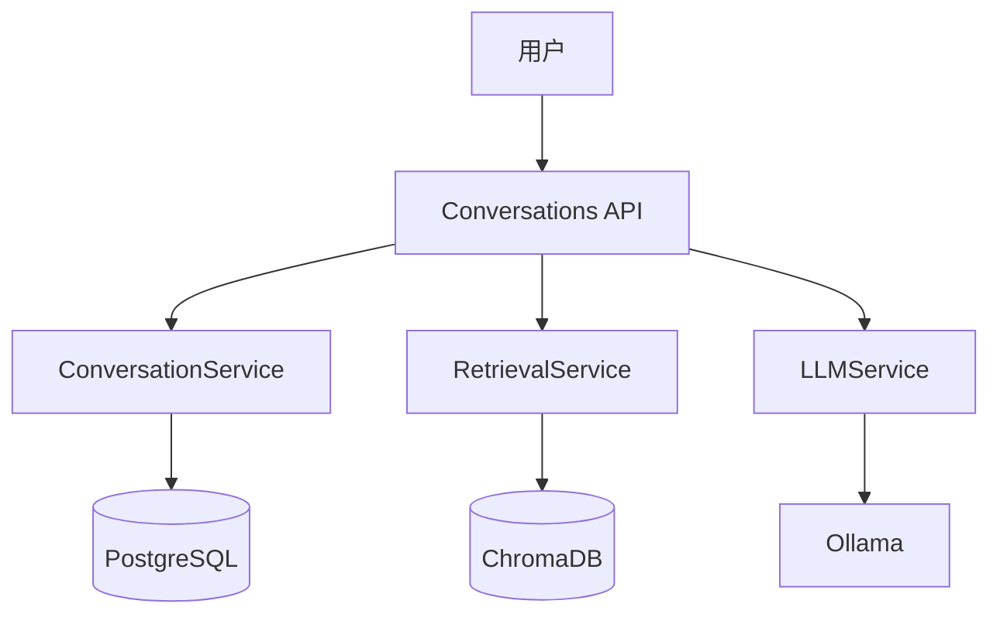

# 多模态文档智能问答系统 - 后端

基于 FastAPI + Ollama + ChromaDB 的本地化文档问答系统后端。

## 功能特性

### Phase 2 (v2.0.0) - 当前版本 ✨
- 💬 **多轮对话管理**：支持创建、查询、删除对话会话
- 🔄 **RAG 智能问答**：自动检索相关文档并生成回答
- ⚡ **流式响应**：实时返回 AI 生成内容（SSE）
- 🧠 **Thinking Chain**：可视化推理过程
- 📤 **对话导出**：支持 Markdown、JSON、PDF 格式
- 🔐 **用户认证**：JWT Token + 会话管理
- 📊 **持久化存储**：PostgreSQL + ChromaDB

### Phase 1 (v1.0.0)
- 📄 支持 PDF、DOCX 文档上传和解析
- 🔍 混合检索（向量检索 + BM25）
- 🤖 基于 Qwen3-VL 的智能问答
- 🎯 本地化部署，数据安全

## 快速开始

### 环境要求

- Python 3.11+
- PostgreSQL 14+
- Redis 7+
- Ollama 0.5.0+
- 8GB+ RAM

### 安装步骤

1. **创建虚拟环境**

```bash
conda create -n multimodal-docqa python=3.11 -y
conda activate multimodal-docqa
```

2. **安装依赖**

```bash
pip install -r requirements.txt
```

3. **配置环境变量**

```bash
cp .env.example .env
# 编辑 .env 文件，配置数据库连接等
```

4. **启动 PostgreSQL 和 Redis**

```bash
# PostgreSQL
psql -U postgres -c "CREATE DATABASE multimodal_docqa;"

# Redis
redis-server
```

5. **初始化数据库**

```bash
# 初始化用户认证表
python scripts/init_db.py

# 初始化对话管理表
python scripts/init_conversation_db.py
```

6. **启动 Ollama 并拉取模型**

```bash
ollama serve
ollama pull qwen3-vl:2b-thinking-q4_K_M
ollama pull qwen3-embedding:0.6b-fp16
```

7. **启动后端服务**

```bash
python -m app.main
# 或
uvicorn app.main:app --reload --host 0.0.0.0 --port 8000
```

8. **访问 API 文档**

打开浏览器访问: http://localhost:8000/docs

## 项目结构

```
backend/
├── app/
│   ├── api/v1/          # API 路由
│   │   ├── auth.py      # 用户认证
│   │   ├── conversations.py  # 对话管理（整合 RAG）
│   │   ├── documents.py # 文档管理
│   │   └── health.py    # 健康检查
│   ├── models/          # 数据模型
│   │   ├── user.py      # 用户模型
│   │   ├── conversation.py  # 对话模型
│   │   └── base.py      # 基础模型
│   ├── schemas/         # Pydantic 模型
│   ├── services/        # 业务逻辑
│   │   ├── auth_service.py  # 认证服务
│   │   ├── conversation_service.py  # 对话服务
│   │   ├── retrieval_service.py  # 检索服务
│   │   ├── llm_service.py  # LLM 服务
│   │   ├── embedding_service.py  # 向量化服务
│   │   └── export_service.py  # 导出服务
│   ├── utils/           # 工具函数
│   ├── config.py        # 配置
│   └── main.py          # 应用入口
├── scripts/             # 脚本工具
├── tests/               # 测试
├── data/                # 数据目录
├── Phase/               # 阶段文档
│   ├── QUICKSTART_PHASE2.md  # Phase 2 快速指南
│   ├── ARCHITECTURE.md       # 技术架构文档
│   └── PHASE2_SUMMARY.md     # Phase 2 总结
├── Q&A.md               # 问题记录
└── requirements.txt     # 依赖
```

## API 接口

### 用户认证

- `POST /api/v1/auth/register` - 用户注册
- `POST /api/v1/auth/login` - 用户登录
- `POST /api/v1/auth/logout` - 用户登出
- `POST /api/v1/auth/refresh` - 刷新 Token
- `GET /api/v1/auth/me` - 获取当前用户信息
- `GET /api/v1/auth/sessions` - 获取活跃会话列表
- `DELETE /api/v1/auth/sessions/{id}` - 撤销指定会话

### 对话管理（整合 RAG）

- `POST /api/v1/conversations` - 创建对话会话
- `GET /api/v1/conversations` - 获取对话列表
- `GET /api/v1/conversations/{id}` - 获取对话详情
- `POST /api/v1/conversations/{id}/messages` - 发送消息（支持 RAG）
- `POST /api/v1/conversations/{id}/messages/stream` - 流式发送消息
- `DELETE /api/v1/conversations/{id}` - 删除对话
- `PATCH /api/v1/conversations/{id}/title` - 更新对话标题
- `GET /api/v1/conversations/{id}/export` - 导出对话

### 文档管理

- `POST /api/v1/documents/upload` - 上传文档
- `GET /api/v1/documents` - 获取文档列表
- `GET /api/v1/documents/{id}` - 获取文档详情
- `DELETE /api/v1/documents/{id}` - 删除文档
- `GET /api/v1/documents/{id}/status` - 获取处理状态

### 系统管理

- `GET /api/v1/health` - 健康检查

## 使用示例

### 1. 用户注册和登录

```python
import requests

BASE_URL = "http://localhost:8000/api/v1"

# 注册
response = requests.post(f"{BASE_URL}/auth/register", json={
    "username": "testuser",
    "email": "test@example.com",
    "password": "password123"
})

# 登录
response = requests.post(f"{BASE_URL}/auth/login", json={
    "username": "testuser",
    "password": "password123"
})
token = response.json()["access_token"]
```

### 2. 创建对话并发送消息

```python
headers = {"Authorization": f"Bearer {token}"}

# 创建对话
response = requests.post(
    f"{BASE_URL}/conversations",
    headers=headers,
    json={"title": "技术讨论"}
)
conversation_id = response.json()["id"]

# 发送消息
response = requests.post(
    f"{BASE_URL}/conversations/{conversation_id}/messages",
    headers=headers,
    json={
        "content": "请介绍一下 FastAPI",
        "enable_thinking": True
    }
)
print(response.json()["content"])
```

### 3. 流式对话

```python
import sseclient

response = requests.post(
    f"{BASE_URL}/conversations/{conversation_id}/messages/stream",
    headers=headers,
    json={"content": "继续聊天"},
    stream=True
)

client = sseclient.SSEClient(response)
for event in client.events():
    data = json.loads(event.data)
    if data['type'] == 'answer':
        print(data['content'], end='', flush=True)
```

## 开发指南

### 运行测试

```bash
pytest tests/
```

### 代码格式化

```bash
black app/
isort app/
```

### 查看日志

```bash
tail -f logs/app.log
```

## 技术栈

| 技术 | 版本 | 用途 |
|------|------|------|
| FastAPI | 0.104+ | Web 框架 |
| SQLAlchemy | 2.0+ | ORM |
| PostgreSQL | 14+ | 关系数据库 |
| ChromaDB | 0.4+ | 向量数据库 |
| Redis | 7+ | 缓存 |
| Ollama | - | 本地大模型 |
| Qwen3-VL | 2b | 多模态大模型 |
| Qwen3-Embedding | 0.6b | 向量化模型 |

## 架构说明

详细的技术架构请参考：[ARCHITECTURE.md](Phase/ARCHITECTURE.md)



## 文档

- [Phase 2 快速启动指南](Phase/QUICKSTART_PHASE2.md)
- [技术架构文档](Phase/ARCHITECTURE.md)
- [Phase 2 实施总结](Phase/PHASE2_SUMMARY.md)
- [问题记录](Q&A.md)

## 版本历史

### v2.0.0 (2026-02-14) - Phase 2
- ✅ 整合 RAG 功能到对话管理
- ✅ 废弃 query 接口，统一使用 conversations
- ✅ 支持流式响应（SSE）
- ✅ 支持对话导出（Markdown/JSON/PDF）
- ✅ 完整的用户认证和会话管理

### v1.0.0 (2026-02-13) - Phase 1
- ✅ 基础 RAG 功能
- ✅ 文档上传与处理
- ✅ 单次问答接口
- ✅ 用户认证

## 许可证

MIT License

